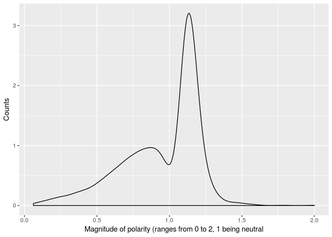
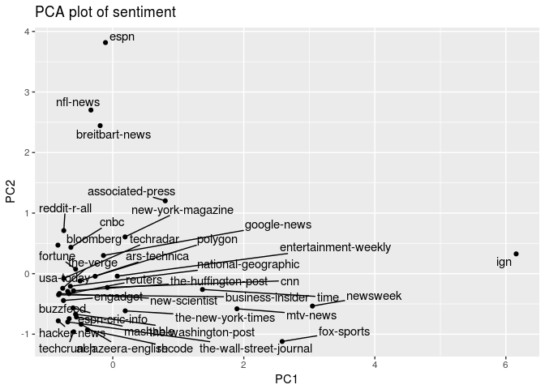

Overview of the method
======================

The ultimate goal is to be able to classify top news articles from popular media into positive or negative sentiment. We all can appreciate that more and more people today are relying on digital media to obtain their daily news. Consequently, there is a lot of competition among news outlets to attract readership. While competition is great, the unfortunate down-side in this case is that the news articles are becoming increasingly more polarized. Polarized articles tend to excite more emotion, and therefore, more likes (or dislikes) which in-turn leads to more attention.

The hypothesis in this case is that we should be able to obtain a pattern of the underlying propensities of each news media towards certain issues. For example, certain left-leaning or right-leaning news outlet might cover the same issue in completely contrasting light. This document shows preliminary analysis to show that it is possible to extract such patterns from top news headlines.

The scripts here will download on-the-fly the currently top news in popular media, and classify them into groups based on their conveyed sentiment.

Learn From Existing Data
------------------------

The first step is to learn how to predict sentiment using existing data. In this example we'll use IMDB movie review database to obtain a list of most polar words. As this is a proof of concept, we are not going to train an NLP model, but show that words do have the power to perform this task.

### Read data and count the frequency of words in positive Vs negative reviews.

We will create two data-frames of positive and negative reviews. This would form our vocabulary for this task.

``` r
TrainDataDir <- "/media/TDI/TDIChallenge/Question_3/News/IMDBReviews/aclImdb/train"
File_Names <- list.files(path = paste0(TrainDataDir,"/pos"), pattern = ".txt$")
Pos.reviews.df <- as.data.frame(matrix(nrow = length(File_Names), ncol = 2))
colnames(Pos.reviews.df) <- c("Nome_of_File", "ReviewContent")
FileName_temp <- NULL

for (i in 1:length(File_Names))
{
  Pos.reviews.df$Nome_of_File[i] <- File_Names[i]
  CurrentFileName <- paste0(TrainDataDir,"/pos/", File_Names[i])
  Pos.reviews.df$ReviewContent[i] <- readChar(CurrentFileName, nchars = 2000)
}

### Now the same for negative reviews ###

File_Names <- list.files(path = paste0(TrainDataDir,"/neg"), pattern = ".txt$")
Neg.reviews.df <- as.data.frame(matrix(nrow = length(File_Names), ncol = 2))
colnames(Neg.reviews.df) <- c("Nome_of_File", "ReviewContent")
FileName_temp <- NULL

for (i in 1:length(File_Names))
{
  Neg.reviews.df$Nome_of_File[i] <- File_Names[i]
  CurrentFileName <- paste0(TrainDataDir,"/neg/", File_Names[i])
  Neg.reviews.df$ReviewContent[i] <- readChar(CurrentFileName, nchars = 2000)
}
```

Extract Polarity Of The Words
-----------------------------

We now need the create a data-frame with all words in our vocabulary and their associated polarity.

``` r
### First convert all positive and negtive reviews into word levels, or vocabulary ##
library (stringr)
#VocabList <- NULL
#VocabList <- as.list (VocabList)
#for (i in 1:1000)
#{
#  VocabList <- c(VocabList, str_split(Pos.reviews.df$ReviewContent))
#}
VocabList <- c(str_split (Pos.reviews.df$ReviewContent, pattern = " "), str_split (Neg.reviews.df$ReviewContent, pattern = " "))
VocabList <- unlist(VocabList)
VocabList <- gsub("[^[:alnum:] ]", "", VocabList)
VocabList <- tolower(VocabList)
VocabList <- VocabList[which(nchar(VocabList) > 0)]
VocabFreq <- table(VocabList)
#hist(VocabFreq)
VocabFreq_sorted <- sort(VocabFreq, decreasing = T)
##### Positive Vobulary ####
Pos_VocabList <- str_split (Pos.reviews.df$ReviewContent, pattern = " ")
Pos_VocabList <- unlist(Pos_VocabList)
Pos_VocabList <- gsub("[^[:alnum:] ]", "", Pos_VocabList)
Pos_VocabList <- tolower(Pos_VocabList)
Pos_VocabList_Freq <- table(Pos_VocabList)
#### Negative vocabulary ####
Neg_VocabList <- str_split (Neg.reviews.df$ReviewContent, pattern = " ")
Neg_VocabList <- unlist(Neg_VocabList)
Neg_VocabList <- gsub("[^[:alnum:] ]", "", Neg_VocabList)
Neg_VocabList <- tolower(Neg_VocabList)
Neg_VocabList_Freq <- table(Neg_VocabList)
#### Find pos neg differences ####
HighVocabFreq <- VocabFreq[which(VocabFreq > 100)]
WordsOfInterest <- names(HighVocabFreq)
WordDiffs.df <- as.data.frame (matrix(nrow = length(WordsOfInterest), ncol = 2))
colnames(WordDiffs.df) <- c("Word", "Freq_Diff")
for (i in 1:length(WordsOfInterest))
{
  Index <- which(names(Pos_VocabList_Freq) == WordsOfInterest[i])
  if (length(Index) == 0)
  {
    TempFreqPos <- 0
  } else
  {
    TempFreqPos <- Pos_VocabList_Freq[Index]
  }
  
  Index <- which(names(Neg_VocabList_Freq) == WordsOfInterest[i])
  if (length(Index) == 0)
  {
    TempFreqNeg <- 0
  } else
  {
    TempFreqNeg <- Neg_VocabList_Freq[Index]
  }
  TempFreqDiff <- (TempFreqPos+1) / (TempFreqNeg+1)
  WordDiffs.df$Word[i] <- WordsOfInterest[i]
  WordDiffs.df$Freq_Diff[i] <- TempFreqDiff
}
TempPosIndex <- match(sort(WordDiffs.df$Freq_Diff,decreasing = T)[1:20],WordDiffs.df$Freq_Diff)
TempNegIndex <- match(sort(WordDiffs.df$Freq_Diff, decreasing = F)[1:20], WordDiffs.df$Freq_Diff)
#WordDiffs.df[c(TempPosIndex,TempNegIndex),]
#hist(WordDiffs.df$Freq_Diff)
TempIndex <- match(sort(WordDiffs.df$Freq_Diff, decreasing = T)[1:200], WordDiffs.df$Freq_Diff)
#WordDiffs.df$Word[TempIndex]
#WordDiffs.df$Word[which(sort(WordDiffs.df$Freq_Diff, decreasing = F)[1:10]]
```

Get News Latest Top Articles From Popular US Media
--------------------------------------------------

We'll now use an API from [News API](https://newsapi.org/) to obtain the top news at this time. After that, we'll process the news articles and make a data-frame that contains the number of times the most polar words occur in those articles.

``` r
library(httr)
library(jsonlite)
tt_sources=GET("https://newsapi.org/v1/sources?language=en&apiKey=5f023192aa0c44bba4fe2fe1ceb9ca72")
tt2 <-rawToChar(tt_sources$content)
tt2 <- fromJSON(tt2)
MyIndex <- which( tt2$sources$country == "us")
tt2$sources$name[MyIndex]
```

    ##  [1] "Al Jazeera English"      "Ars Technica"           
    ##  [3] "Associated Press"        "Bloomberg"              
    ##  [5] "Breitbart News"          "Business Insider"       
    ##  [7] "Buzzfeed"                "CNBC"                   
    ##  [9] "CNN"                     "Engadget"               
    ## [11] "Entertainment Weekly"    "ESPN"                   
    ## [13] "ESPN Cric Info"          "Fortune"                
    ## [15] "Fox Sports"              "Google News"            
    ## [17] "Hacker News"             "IGN"                    
    ## [19] "Mashable"                "MTV News"               
    ## [21] "National Geographic"     "New Scientist"          
    ## [23] "Newsweek"                "New York Magazine"      
    ## [25] "NFL News"                "Polygon"                
    ## [27] "Recode"                  "Reddit /r/all"          
    ## [29] "Reuters"                 "TechCrunch"             
    ## [31] "TechRadar"               "The Huffington Post"    
    ## [33] "The New York Times"      "The Next Web"           
    ## [35] "The Verge"               "The Wall Street Journal"
    ## [37] "The Washington Post"     "Time"                   
    ## [39] "USA Today"

``` r
MyMedia <- tt2$sources$name[MyIndex]
MyMediaIds <- tt2$sources$id[MyIndex]
AllGetArticles <- NULL
AllGetArticles <- as.list(AllGetArticles)
OkStatusIndex <- NULL
for (i in 1:length(MyMedia))
{
  #TempGet <- tt=GET("https://newsapi.org/v1/articles?source=the-next-web&sortBy=latest&apiKey=5f023192aa0c44bba4fe2fe1ceb9ca72")
  GetCommand <- paste0("https://newsapi.org/v1/articles?source=", MyMediaIds[i], "&sortBy=top&apiKey=5f023192aa0c44bba4fe2fe1ceb9ca72")
  TempGet <- GET(GetCommand)
  TempGet <-rawToChar(TempGet$content)
  TempGet <- fromJSON(TempGet)
  if (TempGet$status == "ok")
  {
    OkStatusIndex <- c(OkStatusIndex, i)
  }
  AllGetArticles[[i]] <- TempGet
}
#AllGetArticles_ok <- AllGetArticles[[OkStatusIndex]]
### Make data frame of article qualities ####

HighDiff <- sort(WordDiffs.df$Freq_Diff, decreasing = T)[1:200]
HighIndex <- NULL
for (i in 1:length(HighDiff))
{
  HighIndex <- c(HighIndex, which(WordDiffs.df$Freq_Diff == HighDiff[i]))
}
LowIndex <- NULL
LowDiff <- sort(WordDiffs.df$Freq_Diff, decreasing = F)[1:200]
for (i in 1:length(HighDiff))
{
  LowIndex <- c(LowIndex, which(WordDiffs.df$Freq_Diff == LowDiff[i]))
}
PolarIndex <- sort(unique(c(HighIndex, LowIndex)))
ArticleTypes.df <- as.data.frame(matrix(nrow = length(OkStatusIndex), ncol = length(PolarIndex)))
PolarWords <- WordDiffs.df$Word[PolarIndex]
colnames(ArticleTypes.df) <- PolarWords
MyRowNames <- NULL
iii <- 1
for (CurrentIndex in OkStatusIndex)
{
  ArticleText <- c(AllGetArticles[[CurrentIndex]]$articles[2], AllGetArticles[[CurrentIndex]]$articles[3])
  MyRowNames <- c(MyRowNames, AllGetArticles[[CurrentIndex]]$source)
  ArticleText <- unlist(ArticleText)
  ArticleText <- str_split(ArticleText, pattern = " ")
  ArticleText <- unlist(ArticleText)
  ArticleText <- gsub("[^[:alnum:] ]", "", ArticleText)
  ArticleText <- tolower (ArticleText)
  ArticleTextFreq <- table(ArticleText)
  for (CurrentWord in PolarWords)
  {
    Index <- which(names(ArticleTextFreq) == CurrentWord)
    if (length(Index) > 0)
    {
      CurrentWordFreq <- ArticleTextFreq[Index]
    } else
    {
      CurrentWordFreq <- 0
    }
    ColIndex <- which(colnames(ArticleTypes.df) == CurrentWord)
    ArticleTypes.df[iii, ColIndex] <- CurrentWordFreq
  }
  iii <- iii + 1
}
rownames(ArticleTypes.df) <- MyRowNames
MyPCA <- prcomp(ArticleTypes.df)
PCA.df <- as.data.frame(matrix(nrow = nrow(MyPCA$x), ncol = 2))
colnames(PCA.df) <- colnames(MyPCA$x)[1:ncol(PCA.df)]
rownames(PCA.df) <- rownames(MyPCA$x)
PCA.df[,1] <- MyPCA$x[,1]
PCA.df[,2] <- MyPCA$x[,2]
library(ggplot2)
library(ggrepel)
##### Make plot of word frequency differences ####
WordDiffToNormalize <- WordDiffs.df$Freq_Diff
IndexGr8_1 <- which(WordDiffToNormalize > 1)
WordDiffToNormalize[IndexGr8_1] <- (WordDiffToNormalize[IndexGr8_1] / max(WordDiffToNormalize) + 1)
WordDiffs.df$Freq_Diff_Normalized <- WordDiffToNormalize
```

Make Plots To Infer What It All Means
-------------------------------------

### How polar are the words in our vocabulary?

This first plot should show us the distribution of words in our vocabulary in terms of their polarity.

``` r
p1 <- ggplot(data = WordDiffs.df, aes(Freq_Diff_Normalized))
#p1 <- p1 + geom_histogram (binwidth = 0.01)
p1 <- p1 + geom_density()
p1 <- p1 + labs (x = "Magnitude of polarity (ranges from 0 to 2, 1 being neutral", y = "Counts")
p1
```



This shows that most words are neutral, as we would expect. However, some words are indeed extremely polar.

Additionally, people are more creative in describing positive emotion, as they use more diverse set of words. However, people tend to be less creative in describing negative emotion Many words are occur relatively frequently in negative reviews.

### Can we classify media outlets by the sentiment they present?

Here we'll see if it is possible to extract patterns in media outlets's articles in an unsupervised manner.

``` r
p2 <- ggplot (data = PCA.df, aes(PC1, PC2))
p2 <- p2 + geom_point()
p2 <- p2 + geom_text_repel(aes(PC1,PC2, label = rownames(PCA.df)))
p2 <- p2 + labs (title = "PCA plot of sentiment")
p2
```



``` r
#p2 <- p1
#p2
```

These plots show quite clearly that the news media outlets differ quite drastically in the sentiment of their stories.

This preliminary analysis shows that it is possible to extract the differences in the sentiment conveyed by news articles. In fact, the sentiment conveyed is drastically different for the certain news media outlets.

Therefore, a more fine-grained and accurate classification using RNN (LSTM) is possible.
